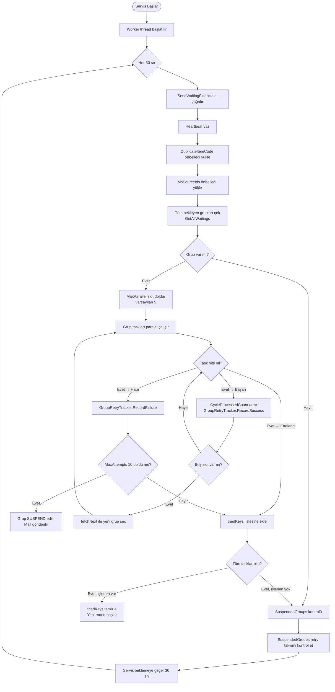
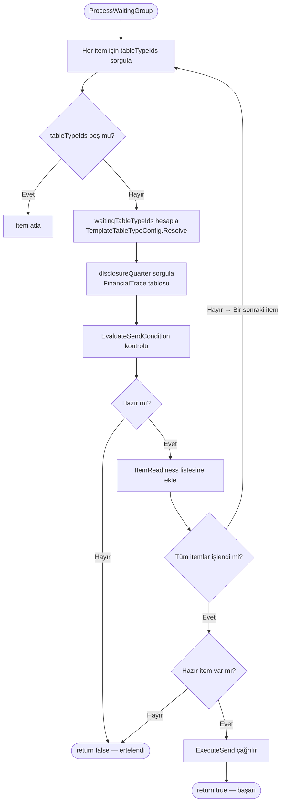
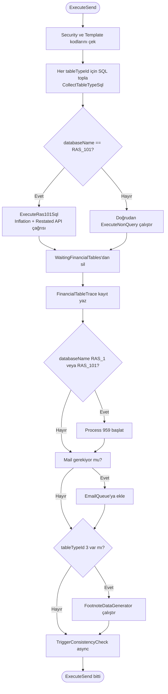
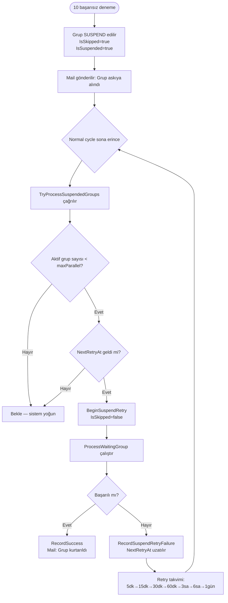

# Financial Throttle Service — Geliştirici Dökümanı

> **Hedef kitle:** .NET Core 10 dönüşümünü yapacak geliştirici  
> **Mevcut teknoloji:** .NET Framework 4.5, Windows Service  
> **Hedef teknoloji:** .NET 10 Worker Service (Backend) + Frontend UI  
> **Önemli:** Geliştirme ortamında gerçek SQL Server / DMS sunucusuna bağlantı **yapılmayacak**. Bunun yerine `RAS_STAJ`, `RAS_STAJ107`, `RAS_STAJ32501` adlı staj veritabanları kullanılacak.

---

## 1. Projenin Amacı

**Financial Throttle Service**, finans verisi yayınlama işlemlerini kuyruk üzerinden, öncelik sırasına göre ve paralel olarak işleyen bir arka plan (background) servisidir.

Basit bir anlatımla:

1. Bir veritabanı tablosunda (`WaitingFinancialTables`) "gönderilmeyi bekleyen" finansal kayıtlar birikir.
2. Bu servis her 30 saniyede bir uyandırır, kuyrukta ne varsa gruplar ve işler.
3. Her grup için gerekli tablo tipleri tamamsa → SQL komutu çalıştırılır ve kayıt silinir.
4. Hata alınırsa retry (yeniden deneme) mantığı devreye girer.
5. Belirli koşullar sağlandığında harici bir REST API çağrılır ve e-posta bildirimi gönderilir.

---

## 2. Mevcut Mimari (Eski Sistem)

```
┌─────────────────────────────────────────────────────────────┐
│              Windows Service (.NET Framework 4.5)           │
│                                                             │
│  Program.cs → FinancialThrottleService (ServiceBase)        │
│       │                                                     │
│       └── Worker Thread (her 30 sn bir çalışır)            │
│               │                                             │
│               └── SendWaitingFinancials()                   │
│                       │                                     │
│               ┌───────┴────────┐                           │
│               ▼                ▼                            │
│      DMS Service (XML/HTTP)   SecurityPriorityClient        │
│      (SQL için proxy)          (HTTP/JSON API)              │
│               │                                             │
│        SQL Server (RAS_STAJ, RAS_STAJ107, RAS_STAJ32501)   │
│               │                                             │
│        FinancialTransaction REST API                        │
│        (generateInflation / generateRestated)               │
└─────────────────────────────────────────────────────────────┘
```

### 2.1 DMS Service Katmanı (Kritik Bilgi)

Orijinal projede SQL Server'a **doğrudan** bağlanılmıyor. `DataManagementStudio.Service` sınıfı, DMS sunucusuna **XML üzerinden HTTP** ile bağlanıyor ve sorguları oradan çalıştırıyor.

```
Servis → DMS Sunucusu (XML/HTTP) → SQL Server
```

Yeni projede bu katman **tamamen kaldırılacak** ve yerine doğrudan bir `IRepository` / `IDataService` arayüzü geçecek. Geliştirme sırasında bu arayüz dummy verilerle doldurulacak.

---

## 3. Hedef Mimari (.NET 10)

```
┌──────────────────────────────────────────────────────────────────┐
│                     BACKEND (.NET 10 Worker Service)             │
│                                                                  │
│  Program.cs (Generic Host)                                       │
│       │                                                          │
│       ├── FinancialThrottleWorker  (BackgroundService)           │
│       │       └── her 30 sn → SendWaitingFinancials()            │
│       │                                                          │
│       ├── IFinancialRepository  ← DummyFinancialRepository       │
│       │       (gerçek: SQL / production)                         │
│       │                                                          │
│       ├── ISecurityPriorityClient  ← DummyPriorityClient         │
│       │                                                          │
│       ├── IFinancialTransactionApi  ← DummyTransactionApi        │
│       │                                                          │
│       └── REST API (ASP.NET Core minimal API)                   │
│               GET  /api/status           → servis durumu        │
│               GET  /api/queue            → bekleyen gruplar      │
│               GET  /api/suspended        → askıya alınan gruplar │
│               POST /api/retry/{key}      → manuel retry          │
│               GET  /api/logs/{date}      → log dosyaları         │
│                                                                  │
└──────────────────────────────────────────────────────────────────┘

┌────────────────────────────────────────────────────────────────┐
│                   FRONTEND (React veya Blazor)                 │
│                                                                │
│   Dashboard  → Kuyruk durumu (canlı)                           │
│   Queue Tab  → Bekleyen gruplar tablosu                        │
│   Suspended  → Askıya alınan gruplar + retry takvimi           │
│   Logs       → Log görüntüleyici                               │
└────────────────────────────────────────────────────────────────┘
```

---

## 4. İş Akışı (Business Flow)

### 4.1 Ana Döngü



### 4.2 Grup İşleme (ProcessWaitingGroup)



### 4.3 ExecuteSend (Gönderim)



### 4.4 Suspend & Retry Takvimi



---

## 5. Temel Sınıflar ve Sorumluluklar

| Sınıf/Modül | Sorumluluk |
|---|---|
| `FinancialThrottleService` | Ana servis sınıfı, Worker döngüsü, paralel task yönetimi |
| `GroupRetryTracker` | In-memory retry/suspend state — servis restart'ta sıfırlanır |
| `SecurityPriorityClient` | Priority API'den score çeker — RAS_101 gruplarını önceliklendirir |
| `TemplateTableTypeConfig` | Hangi templateId için hangi tableTypeId'lerin bekleneceğini tanımlar |
| `ServiceLogger` | Thread-safe dosya logger, 5 kategori, 30 gün sonra arşivleme |
| `CommandLogger` | Eski komut loggeri (ServiceLogger ile değiştirildi, referans olarak kaldı) |
| `Service.Methods.cs` | DMS sunucusu üzerinden SQL çalıştıran istemci |

### 5.1 WaitingGroup Veri Modeli

```
WaitingGroup
├── DatabaseName  (örn. "RAS_101", "RAS_601")
├── SecurityId    (int — şirket/menkul kıymet ID)
├── TemplateId    (int — finansal tablo şablonu)
├── SecurityCode  (string — "THYAO", "SASA" gibi)
└── Items[]
    ├── Quarter      (int — format: YYYYMM, örn. 202403)
    ├── IsOriginal   (bool)
    ├── Username     (string)
    └── DisclosureId (int)
```

### 5.2 Quarter (Dönem) Formatı

Quarter değeri `YYYYMM` formatındadır:
- `202403` = 2024 yılı Mart dönemi (Q1)
- `202406` = 2024 yılı Haziran dönemi (Q2)
- `202409` = 2024 yılı Eylül dönemi (Q3)
- `202412` = 2024 yılı Aralık dönemi (Yıl sonu)

---

## 6. Konfigürasyon (App Settings)

Mevcut `app.config` / `AppSettings`:

| Anahtar | Açıklama | Varsayılan |
|---|---|---|
| `DMSServer` | DMS sunucu adresi (örn. `dms.example.com`) | — |
| `Username` | DMS kullanıcı adı | — |
| `Password` | DMS şifresi | — |
| `MaxParallelGroups` | Eş zamanlı işlenecek maksimum grup sayısı | `5` |

**.NET 10 dönüşümünde** bu değerler `appsettings.json` / `appsettings.Development.json` içine taşınacak.

---

## 7. Önemli İş Kuralları (Dikkat Edilmesi Gereken Noktalar)

### 7.1 Öncelik Skoru

Sadece `RAS_101` veritabanındaki gruplar önceliklendirilir:

| Durum | Skor |
|---|---|
| ERTELITE üyesi **ve** XU030 üyesi | `1.0 + 1.0 = 2.0` |
| Yalnızca ERTELITE üyesi | `0.5 + 1.0 = 1.5` |
| Önceliksiz RAS_101 grubu | `1.0` |
| RAS_101 dışı tüm gruplar | `0.0` |

Aynı skora sahip birden fazla grup varsa aralarından **rastgele** biri seçilir.

### 7.2 Şişirilmiş Şablon (Inflation Templates)

Aşağıdaki templateId'ler özel işleme tabi tutulur — hem `generateInflation` hem de `generateRestated` API'si çağrılır:

```
1, 15, 16, 17, 18, 19, 21, 23, 31, 32, 33,
98, 192, 193, 194, 255, 256, 257, 281, 282
```

### 7.3 Duplicate Item Code Haritası

`DuplicateTableTemplateMap` tablosundan her gün yenilenen bu harita, bazı `(securityId, templateId)` çiftlerinin birden fazla templateId ile işlenmesi gerektiğini belirtir. RAS_101'e özeldir.

### 7.4 EvaluateSendCondition (Gönderim Koşulu)

Bir item'ın "hazır" sayılması için koşullar:

1. **Tüm beklenen tablo tipleri tamamsa** → doğrudan gönder.
2. **Kullanıcı "boss" değilse veya RAS_101 değilse** → `Quarterly`/`QuarterlyOriginal` tablosunda o dönem için veri varsa gönder.
3. **"boss" kullanıcısı + RAS_101 + disclosureQuarter > 1** → Hem `quarter` hem de `disclosureQuarter` için çeyreklik veri mevcut olmalı.

### 7.5 Thread Safety

- Her task kendi bağımsız `ServiceContext` (DMS bağlantısı) oluşturur.
- `runningKeys` ve `triedKeys` `lock(schedulerLock)` ile korunur.
- `_cycleProcessedCount` `Interlocked.Increment` ile güncellenir.
- `GroupRetryTracker` `ConcurrentDictionary` kullanır.
- `ServiceLogger` tek bir writer thread üzerinde çalışır; caller thread'i bloklamaz.

---

## 8. Loglama

Log dosyaları `ThrottleServiceLogs/{yyyy-MM-dd}/` klasöründe günlük olarak tutulur.

| Dosya | İçerik |
|---|---|
| `system.log` | Servis başlangıç/duruş, heartbeat, genel bilgi |
| `financial.log` | Gönderilen/alınan SQL komutları |
| `api.log` | HTTP çağrıları, retry'lar |
| `consistency.log` | Tutarlılık kontrol tetiklemeleri |
| `error.log` | Tüm hatalar ve uyarılar |

**Saklama politikası:**
- 0-29 gün: Dosyalar olduğu gibi tutulur
- 30+ gün: `_Archive/{yyyy-MM-dd}.zip` şeklinde sıkıştırılır, orijinal silinir
- 90+ gün: Zip arşivler silinir

---

## 9. .NET 10 Dönüşümü — Adım Adım Rehber

### 9.1 Proje Yapısı

Önerilen klasör yapısı:

```
FinancialThrottleService/
├── FinancialThrottle.Backend/          ← Worker Service + Minimal API
│   ├── Program.cs
│   ├── appsettings.json
│   ├── appsettings.Development.json    ← dummy config buraya
│   ├── Workers/
│   │   └── FinancialThrottleWorker.cs  ← BackgroundService
│   ├── Services/
│   │   ├── IFinancialRepository.cs
│   │   ├── ISecurityPriorityClient.cs
│   │   └── IFinancialTransactionApi.cs
│   ├── Implementations/
│   │   ├── DummyFinancialRepository.cs ← GELIŞTIRME SIRASINDA KULLANILACAK
│   │   ├── DummySecurityPriorityClient.cs
│   │   └── DummyFinancialTransactionApi.cs
│   ├── Models/
│   │   ├── WaitingGroup.cs
│   │   ├── WaitingItem.cs
│   │   └── SuspendedGroupInfo.cs
│   ├── Logic/
│   │   ├── FinancialScheduler.cs       ← Paralel task yönetimi
│   │   ├── GroupRetryTracker.cs        ← Retry/suspend mantığı (aynı)
│   │   ├── TemplateTableTypeConfig.cs  ← Kural tablosu (aynı)
│   │   └── SendConditionEvaluator.cs   ← EvaluateSendCondition
│   └── Api/
│       └── StatusEndpoints.cs          ← Minimal API endpoint'leri
│
└── FinancialThrottle.Frontend/         ← React veya Blazor
    └── ...
```

### 9.2 .NET Framework → .NET 10 Dönüşüm Tablosu

| Eski (.NET Framework 4.5) | Yeni (.NET 10) |
|---|---|
| `ServiceBase` | `BackgroundService` |
| `Thread` + `AutoResetEvent` | `PeriodicTimer` veya `Task.Delay` loop |
| `ConfigurationManager.AppSettings` | `IConfiguration` + `IOptions<T>` |
| `HttpWebRequest` | `HttpClient` (inject edilmiş) |
| `DataTable` / `DbDataReader` | `List<T>` modelleri veya `IAsyncEnumerable<T>` |
| `Thread.Sleep` | `await Task.Delay(...)` |
| `Task.WaitAny` / `Task.WaitAll` | `await Task.WhenAny` / `await Task.WhenAll` |
| `System.Windows.Forms.Application.StartupPath` | `IHostEnvironment.ContentRootPath` |
| `SemaphoreSlim` | `SemaphoreSlim` (aynı, .NET 10'da mevcut) |
| `ConcurrentDictionary` | `ConcurrentDictionary` (aynı) |
| `Newtonsoft.Json` | `System.Text.Json` (veya Newtonsoft devam edebilir) |
| Windows Service kurulum | `UseWindowsService()` veya `UseSystemd()` |
| `Process.Start(FinancialTester.exe)` | Şimdilik devre dışı bırak veya HTTP API çağrısına dönüştür |

### 9.3 Program.cs Şablonu

```csharp
var builder = Host.CreateApplicationBuilder(args);

// Worker Service
builder.Services.AddHostedService<FinancialThrottleWorker>();

// Bağımlılıklar (dummy veya gerçek)
builder.Services.AddSingleton<GroupRetryTracker>();
builder.Services.AddSingleton<IFinancialRepository, DummyFinancialRepository>();
builder.Services.AddSingleton<ISecurityPriorityClient, DummySecurityPriorityClient>();
builder.Services.AddSingleton<IFinancialTransactionApi, DummyFinancialTransactionApi>();

// HTTP Client
builder.Services.AddHttpClient<ISecurityPriorityClient, DummySecurityPriorityClient>();

// Config
builder.Services.Configure<ThrottleOptions>(
    builder.Configuration.GetSection("ThrottleOptions"));

// API
builder.Services.AddEndpointsApiExplorer();

var app = builder.Build();
app.MapGet("/api/status", ...).WithName("GetStatus");
app.MapGet("/api/queue", ...).WithName("GetQueue");
app.Run();
```

### 9.4 BackgroundService Şablonu

```csharp
public class FinancialThrottleWorker : BackgroundService
{
    private readonly ILogger<FinancialThrottleWorker> _logger;
    private readonly IFinancialRepository _repo;
    private readonly ThrottleOptions _options;

    protected override async Task ExecuteAsync(CancellationToken stoppingToken)
    {
        using var timer = new PeriodicTimer(TimeSpan.FromSeconds(30));

        while (!stoppingToken.IsCancellationRequested &&
               await timer.WaitForNextTickAsync(stoppingToken))
        {
            await SendWaitingFinancialsAsync(stoppingToken);
        }
    }

    private async Task SendWaitingFinancialsAsync(CancellationToken ct)
    {
        // ...orijinal SendWaitingFinancials mantığı buraya async olarak taşınır
    }
}
```

---

## 10. Dummy Data Katmanı

Geliştirme sırasında gerçek SQL Server bağlantısı olmayacak. Aşağıdaki dummy nesneler kullanılacak.

### 10.1 Örnek Dummy WaitingGroups

```csharp
// DummyFinancialRepository.cs
public class DummyFinancialRepository : IFinancialRepository
{
    private static readonly List<WaitingGroup> _dummyQueue = new()
    {
        new WaitingGroup
        {
            DatabaseName = "RAS_101",
            SecurityId = 282,
            TemplateId = 21,
            SecurityCode = "THYAO",
            Items = new List<WaitingItem>
            {
                new WaitingItem { Quarter = 202409, IsOriginal = false,
                                  Username = "boss", DisclosureId = 1001 }
            }
        },
        new WaitingGroup
        {
            DatabaseName = "RAS_101",
            SecurityId = 292,
            TemplateId = 21,
            SecurityCode = "SASA",
            Items = new List<WaitingItem>
            {
                new WaitingItem { Quarter = 202409, IsOriginal = false,
                                  Username = "analyst1", DisclosureId = 1002 }
            }
        },
        new WaitingGroup
        {
            DatabaseName = "RAS_601",
            SecurityId = 50,
            TemplateId = 60,
            SecurityCode = "GAZP",
            Items = new List<WaitingItem>
            {
                new WaitingItem { Quarter = 202412, IsOriginal = false,
                                  Username = "analyst2", DisclosureId = 2001 }
            }
        }
    };

    public Task<List<WaitingGroup>> GetAllWaitingGroupsAsync()
        => Task.FromResult(new List<WaitingGroup>(_dummyQueue));

    public Task DeleteWaitingItemAsync(string databaseName, int securityId,
        int quarter, int templateId, int tableTypeId, bool isOriginal)
    {
        // dummy: sadece log yaz
        return Task.CompletedTask;
    }

    // Diğer metodlar...
}
```

### 10.2 Örnek Dummy Priority Client

```csharp
// DummySecurityPriorityClient.cs
public class DummySecurityPriorityClient : ISecurityPriorityClient
{
    private static readonly Dictionary<string, double> _scores = new()
    {
        { "THYAO", 1.0 },   // ERTELITE + XU030
        { "SASA",  0.5 },   // yalnızca ERTELITE
        { "AKBNK", 0.0 },   // önceliksiz
        { "GAZP",  0.0 }
    };

    public Task<Dictionary<string, double>> GetPrioritiesAsync(string[] securityCodes)
    {
        var result = securityCodes
            .Where(c => _scores.ContainsKey(c))
            .ToDictionary(c => c, c => _scores[c]);
        return Task.FromResult(result);
    }
}
```

### 10.3 Örnek Dummy Transaction API

```csharp
// DummyFinancialTransactionApi.cs
public class DummyFinancialTransactionApi : IFinancialTransactionApi
{
    public Task<string> GenerateInflationAsync(string database, int quarter,
        int securityId, int templateId, string commands)
    {
        // Dummy SQL komutu döndür
        var sql = $"-- [DUMMY] generateInflation DB={database} " +
                  $"SecurityId={securityId} Quarter={quarter} TemplateId={templateId}";
        return Task.FromResult(sql);
    }

    public Task<string> GenerateRestatedAsync(string database, int quarter,
        int securityId, int templateId, string commands)
    {
        var sql = $"-- [DUMMY] generateRestated DB={database} " +
                  $"SecurityId={securityId} Quarter={quarter} TemplateId={templateId}";
        return Task.FromResult(sql);
    }
}
```

---

## 11. REST API Endpoint'leri (Backend)

| Method | Path | Açıklama |
|---|---|---|
| `GET` | `/api/status` | Servis durumu, son heartbeat zamanı |
| `GET` | `/api/queue` | `WaitingGroups` listesi |
| `GET` | `/api/queue/{db}/{securityId}/{templateId}` | Tek grup detayı |
| `GET` | `/api/suspended` | Askıya alınmış gruplar ve retry takvimi |
| `POST` | `/api/suspended/{db}/{securityId}/{templateId}/retry` | Manuel retry tetikle |
| `GET` | `/api/logs` | Log tarih listesi |
| `GET` | `/api/logs/{date}/{category}` | Belirli tarih ve kategoride log içeriği |

---

## 12. Frontend Sayfaları

### Sayfa 1: Dashboard
- Anlık durum kartları (Bekleyen, Çalışan, Askıda, Son işlem zamanı)
- Son 5 işlenen grup

### Sayfa 2: Kuyruk (Queue)
- Tablo: DatabaseName, SecurityCode, TemplateId, Quarter, İtem sayısı, Skor
- Yenile butonu

### Sayfa 3: Askıya Alınanlar (Suspended)
- Tablo: DatabaseName, SecurityCode, TemplateId, İlk hata zamanı, Deneme sayısı, Sonraki retry
- Manuel retry butonu

### Sayfa 4: Loglar
- Tarih seçici
- Kategori sekmeleri (system, financial, api, consistency, error)
- Arama

---

## 13. Sıklıkla Yapılan Hatalar ve Uyarılar

1. **Thread safety unutulmasın.** `GroupRetryTracker` state'i birden fazla task'tan erişilir. `ConcurrentDictionary` kullanmak zorunludur.

2. **Her task kendi bağlantısını açmalı.** Orijinal kodda her task için `BuildServiceContext()` çağrılır. Yeni kodda her task için `IFinancialRepository`'nin ayrı bir scope'u ya da thread-safe bir instance'ı kullanılmalıdır.

3. **Socket exhaustion'a dikkat.** `HttpClient` static singleton olarak tutulur (`SecurityPriorityClient`). .NET 10'da `IHttpClientFactory` ile inject edin.

4. **`PeriodicTimer` CancellationToken alır.** Servis durduğunda döngü temiz çıkacak şekilde yazılmalıdır.

5. **Loglar disk dolduruyor.** `ServiceLogger`'ın retention politikası (30/90 gün) yeni projede de uygulanmalıdır.

6. **Inflation template listesi hard-coded.** `TemplateTableTypeConfig` ve inflation template listesi `.json` config'e taşınabilir; ya da şimdilik hard-coded bırakıp ileride refactor edilebilir.

7. **`Process.Start(FinancialTester.exe)` çağrısı.** Bu özellik üretim ortamına özeldir; geliştirme ortamında devre dışı bırakılmalı veya log yazılmalıdır.

---

## 14. Staj Veritabanları (DB Eşleme)

Gerçek üretim veritabanlarına erişim olmadığı için aşağıdaki **staj veritabanları** kullanılacak.

### 14.1 Veritabanı İsim Eşleme Tablosu

| Üretim DB | Staj DB | Rol |
|---|---|---|
| `RAS_DMS` | `RAS_STAJ` | Servis yönetim DB — kuyruk, e-posta, trace |
| `RAS_0` | `RAS_STAJ` | Referans DB — Source, TableType, TableTemplate2 |
| `RAS_UTIL` | `RAS_STAJ` | Heartbeat DB — ut_trc_tracer_param |
| `RAS_101` | `RAS_STAJ107` | Türkiye finans DB — Security, Quarterly, vb. |
| `RAS_32501` | `RAS_STAJ32501` | MS-source finans DB |
| `RAS_601`, `RAS_801`, `RAS_501` | **Yok** | Staj ortamında bu veritabanları bulunmuyor |

> **Not:** Üretimde `RAS_DMS`, `RAS_0` ve `RAS_UTIL` ayrı veritabanlarıdır. Stajda hepsi tek bir `RAS_STAJ` veritabanında birleştirilmiştir.

### 14.2 Staj Veritabanı Tablo Yeterlilik Analizi

**RAS_STAJ** tabloları:

| Tablo | Kullanım Yeri | Sonuç |
|---|---|---|
| `WaitingFinancialTables` | Ana kuyruk | ✅ Var |
| `DuplicateTableTemplateMap` | Duplicate şablon haritası | ✅ Var |
| `FinancialTrace` | DisclosureQuarter sorgusu | ✅ Var |
| `EmailQueue` | Mail bildirimi | ✅ Var |
| `DataGeneratorGroup` | Dipnot üretici | ✅ Var |
| `ConsistencyCheckGroup` | Tutarlılık kontrol | ✅ Var |
| `FormulaTestGroup` | Formül test | ✅ Var |
| `Source` | MS-source DB tespiti | ✅ Var |
| `TableTemplate2` | Şablon kodu çözümleme | ✅ Var |
| `TableType` | Tablo tipi kodu çözümleme | ✅ Var |
| `ut_trc_tracer_param` | Heartbeat | ✅ Var |

**RAS_STAJ107 ve RAS_STAJ32501** tabloları:

| Tablo | Kullanım Yeri | Sonuç |
|---|---|---|
| `Security` | SecurityCode çözümleme | ✅ Var |
| `Quarterly` | EvaluateSendCondition kontrolü | ✅ Var |
| `QuarterlyOriginal` | EvaluateSendCondition kontrolü | ✅ Var |
| `QuarterlyNote` | Servis doğrudan sorgulamaz, SQL içinde işlenir | ✅ Var (bonus) |
| `QuarterlyOriginalNote` | Servis doğrudan sorgulamaz | ✅ Var (bonus) |
| `FinancialsAnnouncementDate` | Servis doğrudan sorgulamaz | ✅ Var (bonus) |

**Sonuç: Tablolar yeterlidir.** Throttle servisinin tüm iş akışını test etmek için gereken her tablo mevcut.

---

## 15. Kod Değişiklikleri — Hardcoded DB İsimleri

Orijinal kodda DB isimleri string olarak yazılmış. Staj ortamında çalışması için aşağıdaki değişiklikler yapılmalı:

### 15.1 Değiştirilmesi Gereken String'ler

| Dosya | Eski değer | Yeni değer | Kaç yerde |
|---|---|---|---|
| `FinancialThrottleService.cs` | `"RAS_DMS"` | `"RAS_STAJ"` | ~10 yer |
| `FinancialThrottleService.cs` | `"RAS_UTIL"` | `"RAS_STAJ"` | 1 yer |
| `FinancialThrottleService.cs` | `"RAS_0"` | `"RAS_STAJ"` | ~5 yer |
| `FinancialThrottleService.cs` | `"RAS_101"` | `"RAS_STAJ107"` | ~8 yer |
| `FinancialThrottleService.cs` | `"RAS_1"` | `"RAS_STAJ107"` | 2 yer |
| `TemplateTableTypeConfig.cs` | `"RAS_101"` | `"RAS_STAJ107"` | ~5 yer |
| `TemplateTableTypeConfig.cs` | `"RAS_32501"` | `"RAS_STAJ32501"` | ~3 yer |
| `SecurityPriorityClient.cs` | `"RAS_101"` | `"RAS_STAJ107"` | 1 yer |
| `appsettings.json` | `"DMSServer": "dms.example.com"` | Kendi SQL Server adresin | — |

> **Tavsiye:** Bu string'leri `appsettings.json`'dan oku, kodun içine yazma. Böylece üretim → staj geçişi tek bir config değişikliğiyle olur.

### 15.2 Config'e Taşıma Önerisi

```json
// appsettings.Development.json
{
  "DatabaseNames": {
    "Management": "RAS_STAJ",
    "Reference":  "RAS_STAJ",
    "Heartbeat":  "RAS_STAJ",
    "Turkey":     "RAS_STAJ107",
    "MsSource":   "RAS_STAJ32501"
  }
}
```

```csharp
// appsettings.Production.json
{
  "DatabaseNames": {
    "Management": "RAS_DMS",
    "Reference":  "RAS_0",
    "Heartbeat":  "RAS_UTIL",
    "Turkey":     "RAS_101",
    "MsSource":   "RAS_32501"
  }
}
```

---

## 16. Dummy Data INSERT Scriptleri

Staj veritabanlarına başlangıç verisi eklemek için aşağıdaki SQL scriptlerini çalıştır.

### 16.1 RAS_STAJ — Referans Tabloları

```sql
-- ============================================================
-- Source: RAS_STAJ32501'in MS-source DB olarak tanınması için
-- ============================================================
INSERT INTO dbo.Source (id, vendorId)
VALUES (32501, 9);

-- ============================================================
-- TableType: Tablo tipi tanımları
-- dataType = 'Q' → quarterly tipler (ClassifyFormulaTestGroup kullanır)
-- ============================================================
INSERT INTO dbo.TableType (id, code, dataType)
VALUES
  (1, 'Q',   'Q'),   -- Quarterly (Çeyreklik ana veri)
  (2, 'TTM', 'Q'),   -- Trailing Twelve Months
  (3, 'N',   'N'),   -- Notes / Dipnotlar
  (4, 'A',   'A');   -- Appendix / Ekler

-- ============================================================
-- TableTemplate2: Şablon tanımları
-- ============================================================
INSERT INTO dbo.TableTemplate2 (id, code)
VALUES
  (21,  'BALANCE_SHEET'),      -- RAS_STAJ107 için bilanço (inflation template)
  (241, 'MS_BALANCE_SHEET');   -- RAS_STAJ32501 için bilanço

-- ============================================================
-- DuplicateTableTemplateMap: THYAO için templateId=21 işlenirken
-- templateId=1 de işlenecek (duplicate eşlemesi)
-- sourceId=101 filtresi kodda sabit — bu değeri değiştirme
-- ============================================================
INSERT INTO dbo.DuplicateTableTemplateMap (securityId, toTemplateId, fromTemplateId, sourceId)
VALUES (282, 21, 1, 101);
```

### 16.2 RAS_STAJ — Kuyruk (WaitingFinancialTables)

```sql
-- ============================================================
-- Senaryo A: THYAO (282) — tüm tableTypeId'ler (1,2,3) hazır
-- → EvaluateSendCondition KOŞUL 1 anında TRUE döner → gönderilir
-- ============================================================
INSERT INTO dbo.WaitingFinancialTables
  (databaseName, securityId, quarter, templateId, tableTypeId,
   isOriginal, username, disclosureId, sql, sendEmail, disabledRules, date)
VALUES
  ('RAS_STAJ107', 282, 202409, 21, 1, 0, 'boss',     1001, '', 1, NULL, GETDATE()),
  ('RAS_STAJ107', 282, 202409, 21, 2, 0, 'boss',     1001, '', 1, NULL, GETDATE()),
  ('RAS_STAJ107', 282, 202409, 21, 3, 0, 'boss',     1001, '', 1, NULL, GETDATE());

-- ============================================================
-- Senaryo B: SASA (292) — sadece tableTypeId 1 ve 2 var, 3 eksik
-- → KOŞUL 1 başarısız → KOŞUL 2 devreye girer
--   username='analyst1' (boss değil) → Quarterly tablosuna bakar
--   RAS_STAJ107.Quarterly'de veri varsa gönderilir, yoksa beklenir
-- ============================================================
INSERT INTO dbo.WaitingFinancialTables
  (databaseName, securityId, quarter, templateId, tableTypeId,
   isOriginal, username, disclosureId, sql, sendEmail, disabledRules, date)
VALUES
  ('RAS_STAJ107', 292, 202409, 21, 1, 0, 'analyst1', 1002, '', 0, NULL, GETDATE()),
  ('RAS_STAJ107', 292, 202409, 21, 2, 0, 'analyst1', 1002, '', 0, NULL, GETDATE());

-- ============================================================
-- Senaryo C: RAS_STAJ32501 — templateId=241, typeId 1 ve 2 hazır
-- TemplateTableTypeConfig → RAS_STAJ32501 + templateId=241 → [1,2] gerekli
-- → KOŞUL 1 anında TRUE döner → gönderilir
-- ============================================================
INSERT INTO dbo.WaitingFinancialTables
  (databaseName, securityId, quarter, templateId, tableTypeId,
   isOriginal, username, disclosureId, sql, sendEmail, disabledRules, date)
VALUES
  ('RAS_STAJ32501', 50, 202412, 241, 1, 0, 'analyst2', 2001, '', 0, NULL, GETDATE()),
  ('RAS_STAJ32501', 50, 202412, 241, 2, 0, 'analyst2', 2001, '', 0, NULL, GETDATE());
```

> **`sql` kolonu neden boş?** Gerçek sistemde bu kolon çalıştırılacak SQL'i içerir. Staj ortamında dummy implementasyon bu SQL'i çalıştırmaz, sadece loglar. Boş bırakmak güvenlidir.

> **`FinancialTrace` boş bırakılabilir.** `disclosureQuarter` sorgusu sonuç dönmezse `ISNULL(quarter, 1) = 1` olur. `disclosureQuarter = 1` iken KOŞUL 3 (`disclosureQuarter > 1`) hiçbir zaman aktive olmaz. Bu geliştirme için yeterlidir.

### 16.3 RAS_STAJ107 — Turkey Hedef Veritabanı

```sql
-- Security: Şirket kayıtları
INSERT INTO dbo.Security (id, code)
VALUES
  (282, 'THYAO'),   -- Türk Hava Yolları
  (292, 'SASA'),    -- Sabancı Holding
  (346, 'AKBNK');   -- Akbank

-- Quarterly: Senaryo B'nin KOŞUL 2'den geçmesi için (isteğe bağlı)
-- SASA (292), quarter=202409, templateId=21 için veri → SASA gönderilir
INSERT INTO dbo.Quarterly
  (securityId, quarter, templateId, tableTypeId, itemQuarterlyCode)
VALUES
  (292, 202409, 21, 1, 'SASA_2024Q3_B_CODE');

-- QuarterlyOriginal: Başlangıçta boş bırakılabilir
```

### 16.4 RAS_STAJ32501 — MS-Source Hedef Veritabanı

```sql
-- Security: MS-source şirket kaydı
INSERT INTO dbo.Security (id, code)
VALUES (50, 'MSSTOCK');

-- Quarterly ve QuarterlyOriginal: Başlangıçta boş bırakılabilir
```

### 16.5 Beklenen Test Sonuçları

Yukarıdaki verileri ekledikten sonra servisi başlatınca:

| Grup | Beklenti |
|---|---|
| THYAO / RAS_STAJ107 / T21 | İlk cycle'da işlenir (KOŞUL 1 ✅) |
| SASA / RAS_STAJ107 / T21 | Quarterly'de veri varsa işlenir (KOŞUL 2 ✅), yoksa bekler |
| MSSTOCK / RAS_STAJ32501 / T241 | İlk cycle'da işlenir (KOŞUL 1 ✅) |

---

## 17. Glossary (Terimler)

| Terim | Açıklama |
|---|---|
| `WaitingFinancialTables` | Gönderilmeyi bekleyen finansal kayıtların tutulduğu kuyruk tablosu |
| `SecurityId` | Şirket/menkul kıymet kimliği (örn. THYAO = 282) |
| `TemplateId` | Finansal tablo şablonu kimliği (bilanço, gelir tablosu vb.) |
| `TableTypeId` | Tablo tipi: 1=Çeyreklik, 2=TTM, 3=Dipnot, 4=Ek |
| `Quarter` | Dönem, YYYYMM formatında (202409 = Eylül 2024) |
| `DisclosureId` | Kamuya açıklama kimliği |
| `IsOriginal` | Orijinal veri mi (true) yoksa düzeltilmiş mi (false) |
| `RAS_STAJ` | Staj yönetim + referans veritabanı (üretimde RAS_DMS + RAS_0 + RAS_UTIL) |
| `RAS_STAJ107` | Staj Türkiye finans DB (üretimde RAS_101) |
| `RAS_STAJ32501` | Staj MS-source finans DB (üretimde RAS_32501) |
| `Suspend` | Grubun 10 başarısız denemeden sonra geçici olarak devre dışı bırakılması |
| `Inflation` | Enflasyon düzeltmesi API'si (yalnızca belirli templateId'ler) |
| `Restated` | Yeniden düzenlenmiş finansal veri API'si |
| `ERTELITE` | Yüksek öncelikli şirketler listesi |
| `XU030` | Borsa İstanbul 30 endeksi üyeleri |
